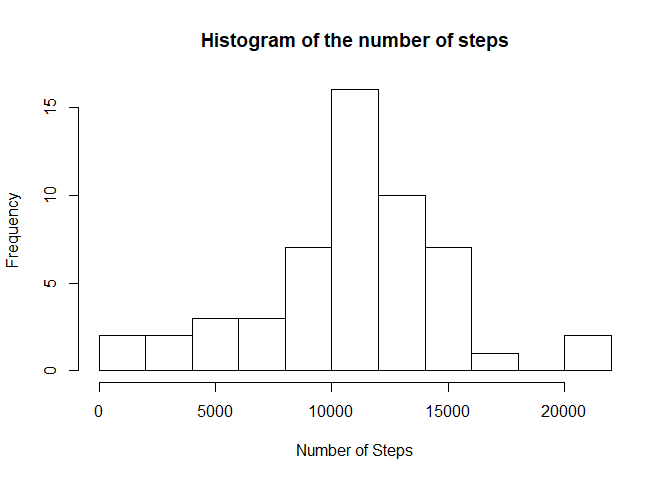
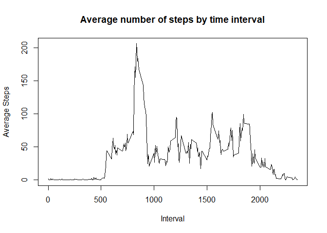
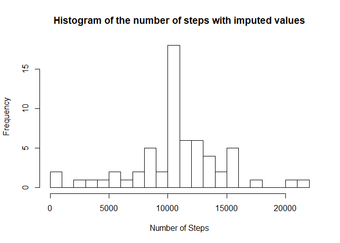
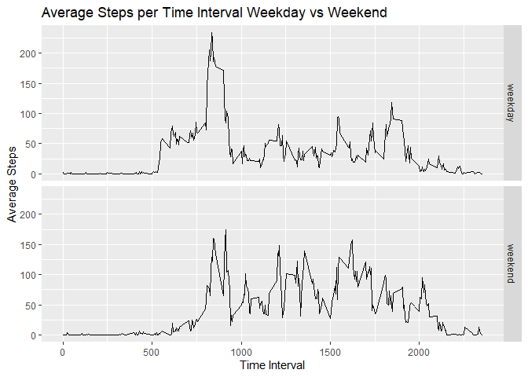

## Loading and preprocessing the data


```r
setwd("C:/Users/kilsi/OneDrive/Coursera R/reproduce")
data.with.na = read.csv("activity.csv",header = TRUE)   
data = data.with.na[!is.na(data.with.na$steps),]
```

## What is mean total number of steps taken per day?

Below will display a histogram of the Number of steps in the dataset


```r
library(dplyr)
```

```
## 
## Attaching package: 'dplyr'
```

```
## The following objects are masked from 'package:stats':
## 
##     filter, lag
```

```
## The following objects are masked from 'package:base':
## 
##     intersect, setdiff, setequal, union
```

```r
Sum.by.date = data %>% group_by(date) %>% summarise(steps = sum(steps))
hist(Sum.by.date$steps,breaks=10,xlab="Number of Steps",main="Histogram of the number of steps")
```

<!-- -->

The mean is :


```r
mean(Sum.by.date$steps)
```

```
## [1] 10766.19
```

The median is :

```r
median(Sum.by.date$steps)
```

```
## [1] 10765
```

## What is the average daily activity pattern?

The plot below describes a time-series graph with the average steps by time interval.

```r
average.steps.by.interval = data %>% group_by(interval) %>% summarise(steps = mean(steps))
plot(average.steps.by.interval$interval,average.steps.by.interval$steps, type="l",xlab="Interval",ylab="Average Steps", main="Average number of steps by time interval")
```

<!-- -->

```r
colnames(average.steps.by.interval)[2] = "Average Steps"
```

The Interval with the highest average number of steps is :

```r
average.steps.by.interval[which.max(average.steps.by.interval$`Average Steps`),]
```

```
## # A tibble: 1 x 2
##   interval `Average Steps`
##      <int>           <dbl>
## 1      835            206.
```


## Imputing missing values

The number of missing values is :


```r
sum(is.na(data.with.na$steps))
```

```
## [1] 2304
```

Below will display a histogram of the Number of steps in the dataset with imputed values for the NA values

```r
merged.df = merge(data.with.na,average.steps.by.interval,by.x="interval",by.y = "interval",all.x = TRUE)
merged.df$steps = ifelse(is.na(merged.df$steps),merged.df$`Average Steps`,merged.df$steps)
Sum.by.date.imputed = merged.df %>% group_by(date) %>% summarise(steps = sum(steps))
hist(Sum.by.date.imputed$steps,breaks=30,xlab="Number of Steps",main="Histogram of the number of steps with imputed values")
```

<!-- -->

The mean and median are :


```r
mean(Sum.by.date.imputed$steps)
```

```
## [1] 10766.19
```

```r
median(Sum.by.date.imputed$steps)
```

```
## [1] 10766.19
```

The imputed values have changed the median to equal the mean for the number of steps.


## Are there differences in activity patterns between weekdays and weekends?

Converting the date within the dataset to a date-time object and comparing the average steps over the same time intervals over weekend or weekdays demonstrated in the graph below illustrates there is a difference in the participants activity levels.


```r
data$date = as.Date(data$date)
data$Day = weekdays(data$date)
weekend = c("Saturday","Sunday")
data$Day = ifelse(data$Day %in% weekend,"weekend","weekday")

average.steps.by.int.week = data %>% group_by(interval,Day) %>% summarise(steps = mean(steps))
average.steps.by.int.week$Day = as.factor(average.steps.by.int.week$Day)
library(ggplot2)
qplot(average.steps.by.int.week$interval,average.steps.by.int.week$steps,data=average.steps.by.int.week, facets= Day~.,geom="path",xlab="Time Interval",ylab="Average Steps",main="Average Steps per Time Interval Weekday vs Weekend")
```

<!-- -->
